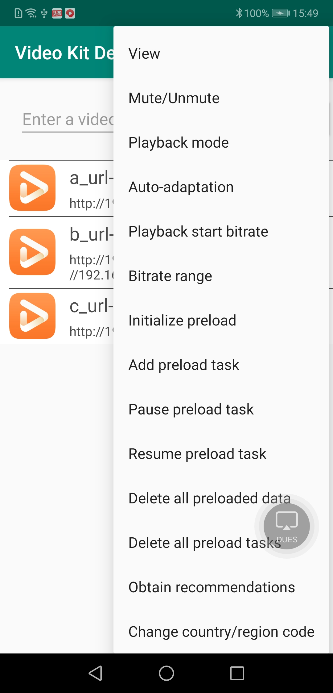
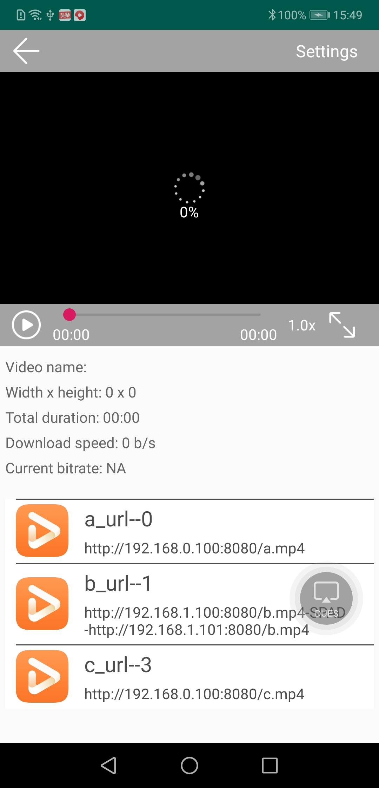
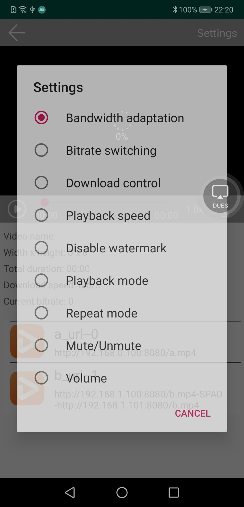

# HMS Video Demo

## Table of Contents

 * [Introduction](#Introduction)
 * [Getting Started](#Getting-Started)
 * [Supported Environments](#Supported-Environments)
 * [Result](#Result)
 * [License](#License)

## Introduction
The sample code is used to implement the function of playing videos through the Video Kit player SDK.
The following describes the structure of the sample code:

  - activity:   UI, which contains the video list and playback screen.
  - adapter:    Adapter of the video list screen.
  - contract:   Stores API classes.
  - control:    A class used to control UI data.
  - entity:     An entity class of the playback data.
  - utils:      A tool class.
  - view:       A layout view displayed on the UI.

## Getting Started
We provide an example to demonstrate the use of Video SDK for Android.

This sample uses the Gradle build system.

First download the demo by cloning this repository or downloading an archived snapshot.

In Android Studio, use the "Open an existing Android Studio project", and select the directory of "src".

You can use the "gradlew build" command to build the project directly.

You should create an app in AppGallery Connect, and obtain the file of agconnect-services.json and add to the project. You should also generate a signing certificate fingerprint  and add the certificate file to the project, and add configuration to build.gradle. See the [Configuring App Information in AppGallery Connect](https://developer.huawei.com/consumer/en/doc/development/HMSCore-Guides/config-agc-0000001050738427) guide to configure app in AppGallery Connect.

For more development details, please refer to the following link:

- [Development Guide](https://developer.huawei.com/consumer/en/doc/development/HMSCore-Guides-V5/introduction-0000001050439577-V5)
- [API References](https://developer.huawei.com/consumer/en/doc/development/HMSCore-References-V5/overview-0000001050439393-V5)

## Supported Environments
   It is recommended that the EMUI version be 3.0 or later and the JDK version be 1.8 or later.
To play a video using the sample code, ensure that HMS Core (APK) 5.0.0.300 or a later version has been installed on your phone.

## Result
   
   
   
   

## License
   Video Kit Android Sample is licensed under the [Apache License, version 2.0](http://www.apache.org/licenses/LICENSE-2.0).
