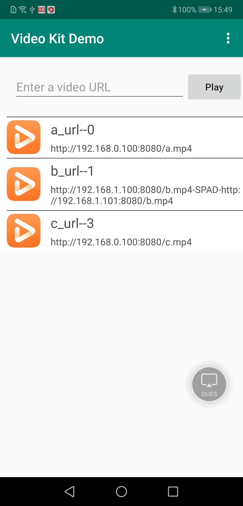

# 华为视频服务示例代码

中文 | [English](README.md)

## 目录

 * [简介](#简介)
 * [开发准备](#开发准备)
 * [环境要求](#环境要求)
 * [运行结果](#运行结果)
 * [授权许可](#License)

## 简介
华为视频服务（HUAWEI Video Kit）示例代码帮助您集成Video Kit播放器SDK，实现视频播放。本示例代码包含如下文件夹：

  - activity:   界面，包括视频列表和播放页面。
  - adapter:    视频列表界面的适配器。
  - contract:   包含的接口类。
  - control:    控制界面数据的类。
  - entity:     播放数据的实体类。
  - utils:      工具类。
  - view:       展示在界面上的布局视图。

## 开发准备
本示例代码使用Gradle进行编译，向您介绍如何在安卓设备上集成Video SDK。

1. 通过克隆仓库或下载压缩包，获取本示例代码。

2. 在Android Studio中，打开一个现有的工程，选择src目录。

3. 使用gradlew build命令编辑该工程。

4. 在AppGallery Connect中新建应用，获取agconnect-services.json文件并将其添加到项目中。生成签名证书指纹，将证书文件添加到项目中，并配置build.gradle文件。详情请参见[配置AppGallery Connect](https://developer.huawei.com/consumer/cn/doc/development/HMSCore-Guides/config-agc-0000001050738427)。
如想了解更多信息，请前往:

- [开发指南](https://developer.huawei.com/consumer/cn/doc/development/HMSCore-Guides-V5/introduction-0000001050439577-V5)
- [API参考](https://developer.huawei.com/consumer/cn/doc/development/HMSCore-References-V5/overview-0000001050439393-V5)

## 环境要求
推荐使用EMUI 3.0及以上版本、JDK 1.8及以上版本。使用示例代码播放视频时，请确保您的手机已安装HMS Core (APK) 5.0.0.300及以上版本。

## 运行结果
   

## 技术支持
如果您对HMS Core还处于评估阶段，可在[Reddit社区](https://www.reddit.com/r/HuaweiDevelopers/)获取关于HMS Core的最新讯息，并与其他开发者交流见解。

如果您对使用HMS示例代码有疑问，请尝试：
- 开发过程遇到问题上[Stack Overflow](https://stackoverflow.com/questions/tagged/huawei-mobile-services)，在`huawei-mobile-services`标签下提问，有华为研发专家在线一对一解决您的问题。
- 到[华为开发者论坛](https://developer.huawei.com/consumer/cn/forum/blockdisplay?fid=18) HMS Core板块与其他开发者进行交流。

如果您在尝试示例代码中遇到问题，请向仓库提交[issue](https://github.com/HMS-Core/hms-video-demo-android/issues)，也欢迎您提交[Pull Request](https://github.com/HMS-Core/hms-video-demo-android/pulls)。

## 授权许可
华为视频服务示例代码经过[Apache License, version 2.0](http://www.apache.org/licenses/LICENSE-2.0)授权许可。
