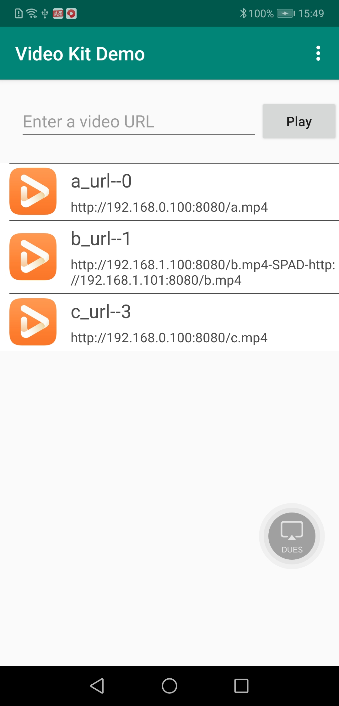
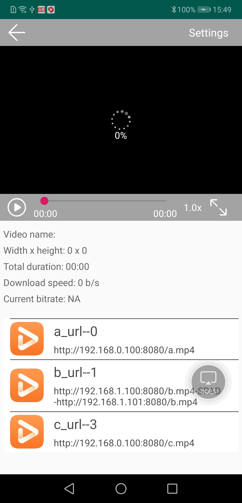
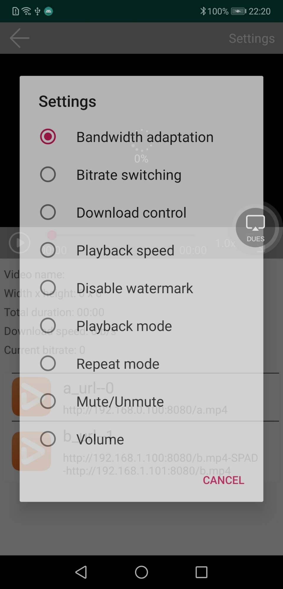

# Video Kit Android Sample

## Table of Contents
 * [Introduction](#Introduction)
 * [Installation](#Installation)
 * [Configuration](#Configuration)
 * [Supported Environments](#Supported-Environments)
 * [Sample Code](#Sample-Code)
 * [Result](#Result)
 * [License](#License)

## Introduction
   The sample code is used to implement the function of playing videos through the Video Kit player SDK.
The following describes the structure of the sample code:

   activity:   UI, which contains the video list and playback screen.
   adapter:    Adapter of the video list screen.
   contract:   Stores API classes.
   control:    A class used to control UI data.
   entity:     An entity class of the playback data.
   utils:      A tool class.
   view:       A layout view displayed on the UI.

## Installation
   Decompress the sample code package "videokit-player-sample-x.x.x.xxx.zip".
Take the Android Studio 3.x version as an example. The steps to run the Video Kit player SDK sample code are as follows:

   1. You should modify the applicationId in the build.gradle.
   2. You should create an app in AppGallery Connect, and obtain the file of agconnect-services.json and add to the project.
   3. You should also generate a signing certificate fingerprint and add the certificate file to the project, and add configuration to build.gradle.
   See the [Preparations for Integrating HUAWEI HMS Core](https://developer.huawei.com/consumer/en/codelab/HMSPreparation/index.html) guide to configure app in AppGallery Connect.
   4. In Android Studio, select "File > Open". In the pop-up dialog box, enter the path where the sample code is stored locally, for example: "D:\videokit-player-sample-x.x.x.xxx\VideoKitDemo\src";
   5. Select the src project to be opened, and then click "OK". In the pop-up dialog box, select "New Window" to open the project in a new window.
   6. In Android Studio, replace the URL in the video_kit_demo.txt file with the URL of the video to be played.
   7. In Android Studio, click "Run", then select your device as the target and click "OK" to launch the sample application on your device.

## Configuration
   The video_kit_demo.txt file has been placed in the assets directory.
Data structure in video_kit_demo.txt:

   id:          Unique ID of the video.
   urlType:     Type of the video. Two options are available: 0 (single video URL) and 1 (multiple video URLs). Use "-SPAD-" to combine multiple video URLs.
   url:         URL of the video.
   name:        Name of the video.

## Supported Environments
   It is recommended that the EMUI version be 3.1 or later and the JDK version be 1.8.211 or later.
To play a video using the sample code, ensure that HMS Core (APK) 5.0.0.300 or a later version has been installed on your phone.

## Sample Code
   The sample code provides the following scenarios:

   1. Play a video.
   2. Switch to the specified bitrate.
   3. Enable or disable the repeat mode.
   4. Set the playback mode (audio or audio+video).
   5. Mute or unmute.
   6. Adjust the playback speed.

## Result
   
   
   
   

## License
   Video Kit Android Sample is licensed under the [Apache License, version 2.0](http://www.apache.org/licenses/LICENSE-2.0).
