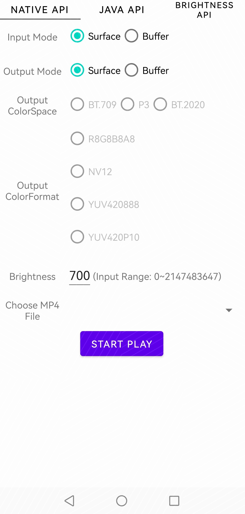

# 华为视频服务示例代码

中文 | [English](README.md)

## 目录

* [简介](#简介)
* [开发准备](#开发准备)
* [环境要求](#环境要求)
* [运行结果](#运行结果)
* [技术支持](#技术支持)
* [授权许可](#License)

## 简介
华为视频服务（HUAWEI Video Kit）示例代码帮助您集成HDR Vivid Kit SDK，实现HDR Vivid视频图像的OETF、Tonemapping、HDR2SDR等能力，助力您快速构建HDR Vivid视频的播放、分享特性。示例代码展示了解析HDR Vivid格式的视频源文件， 获取到视频流和元数据信息后，如何和SDK交互，实现渲染或转码。从示例代码中，可以获得以下参考：

1、Java接口的集成和调用方式。

2、Native接口的集成和调用方式。

3、渲染数据来源于一个Surface场景的处理处理流程。

4、渲染数据来源于缓冲输入场景的处理处理流程。

5、SDK工作在渲染模式的处理流程。

6、SDK工作在转码模式的处理流程。

## 开发准备
本示例代码使用Gradle进行编译，向您介绍如何在安卓设备上集成HDR Vivid Kit SDK。

1. 通过克隆仓库或下载压缩包，获取本示例代码。

2. 在Android Studio中，打开一个现有的工程，选择src目录。

3. 下载HDR Vivid Kit SDK，并解压，复制so库和头文件到指定目录。

4. 获取HDR Vivid格式的MP4视频源文件，Push到手机/sdcard/Documents/vivid/目录下。

5. 在hdrvivid目录下，使用gradlew build命令编辑该工程。

6. 在AppGallery Connect中新建应用，获取agconnect-services.json文件并将其添加到项目中。生成签名证书指纹，将证书文件添加到项目中，并配置build.gradle文件。详情请参见[配置AppGallery Connect](https://developer.huawei.com/consumer/cn/doc/development/Media-Guides/config-agc-0000001050738427?ha_source=hms1)。
   如想了解更多信息，请前往:

- [开发指南](https://developer.huawei.com/consumer/cn/doc/development/Media-Guides/introduction-0000001050439577?ha_source=hms1)
- [API参考](https://developer.huawei.com/consumer/cn/doc/development/Media-References/video-description-0000001076873506?ha_source=hms1)

## 环境要求
1. 推荐使用Android 10/Emui 10及以上版本。
2. JDK 1.8及以上版本。
3. cmake 3.18.3版本。

## 运行结果

## 技术支持
如果您对HMS Core还处于评估阶段，可在[Reddit社区](https://www.reddit.com/r/HuaweiDevelopers/)获取关于HMS Core的最新讯息，并与其他开发者交流见解。

如果您对使用HMS示例代码有疑问，请尝试：
- 开发过程遇到问题上[Stack Overflow](https://stackoverflow.com/questions/tagged/huawei-mobile-services?tab=Votes)，在`huawei-mobile-services`标签下提问，有华为研发专家在线一对一解决您的问题。
- 到[华为开发者论坛](https://developer.huawei.com/consumer/cn/forum/blockdisplay?fid=18) HMS Core板块与其他开发者进行交流。

如果您在尝试示例代码中遇到问题，请向仓库提交[issue](https://github.com/HMS-Core/hms-video-demo-android/issues)，也欢迎您提交[Pull Request](https://github.com/HMS-Core/hms-video-demo-android/pulls)。

## 授权许可
华为视频服务示例代码经过[Apache License, version 2.0](http://www.apache.org/licenses/LICENSE-2.0)授权许可。
